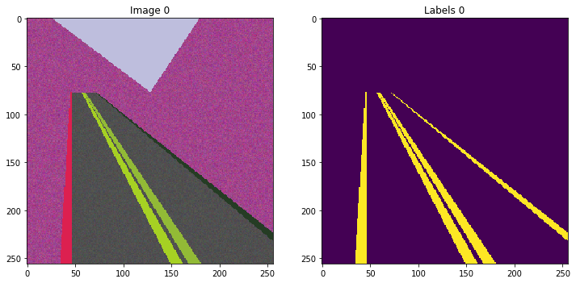

# Semi-supervised road-lane markings detection for autonomous driving

### By Soroosh Tayebi Arasteh

This project was part of the Labopraktikum Machine Learning in Signal Processing of the Electrical, Electronics, and Communications (EEI) department at University of Erlangen-Nuremberg (FAU).

Introduction
------
In autonomous driving, among other things, the car needs to steer itself to keep driving in its own lane. To accomplish this, the central problem is to detect the road-lane markings. These are the white solid or dashed lines that are drawn on each side of the lane. 
The standard modern approach to solve this type of problems is to take a large dataset of labeled examples and train a deep neural network model to accomplish the task. This is how car and pedestrian detection algorithms are developed. The difficulty with the road-lane markings is that there is no labeled dataset of them and creating such dataset would cost millions of dollars. 
### Goal of this project 
To solve the afformentioned problem, using a dataset of simulated images intermixed with a dataset of real images that contain no road.

Installation of requirements
------

The software is developed in **Python 2.7** using **Jupyter Notebook** development kit. For the deep learning, the **PyTorch 0.4** framework is used.

All Python modules required for the software can be installed from `requirements` in two stages:
1. Create a conda environment and install all modules mentioned in the `spec_file.txt`:

`$ conda create --name soroosh --file spec_file.txt`

2. Install the remaining dependencies from `requirements.txt` using pip:

`$ pip install -r requirements.txt`

Proposed architecture
------
The [architecture](https://github.com/starasteh/lane-detection/blob/master/models/Architecture.pdf) used in this software is a variant of the [U-Net](https://arxiv.org/pdf/1505.04597.pdf) architecture.

Training
------
#### Training data
Intermixed dataset of:
1. 258 real images which contain no lane, from folder `True_Negative_Dataset_Train`.
2. 1000 simulated cartoon-like images of road containing lanes. You can generate as much simulate images as you want from `simulator`. Done in Python, you can find the codes of simulation in `simulator`. An example image is shown below.

#### Training details

The network is trained with the following details:

| Name        | Value           |
| ------------- |:-------------:| 
| Learning rate    | 0.01 (fixed) 
| Number of epochs | 13 
| Loss function    | CrossEntropyLoss   
| Optimizer        | SGD with a batch size of 1
| Lane to no-lane weight ratio  | 3      

No data augmentation is used on the `True_Negative_Dataset_Train` dataset. ReLU is used as the activatoin function and batch normalization is used.

Results
------
You can see the input video [here](https://github.com/SorooshTA/lane-detection/raw/master/data/input_data/Video/3911-3931.mp4) and the output video [here](https://github.com/SorooshTA/lane-detection/raw/master/data/output_data/outputvideo.mp4).

As you can see in the video, predictions are pretty acceptable considering that we have given no single **real** TP image as the input to the network. Also, the simulated images are very simple. Simulating images more close to reality would lead to better performance though. 

